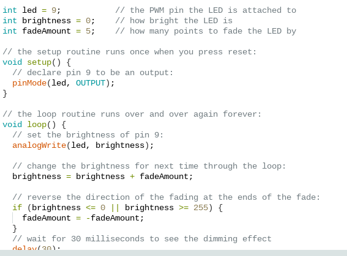

# NotSoBasicArduino
---
## Table of Contents
* [Table of Contents](#Table-of-Contents)
* [LedFade](#LEDFADE)
* [LedBlink 5 Times](#LEDBLINK5TIMES)
* [Fork](#Fork)
* [Tire](#Tire)
* [Wheel](#Wheel)
* [AxleCollarBearings](#AxleCollarBearings)
* [Sub Asssembly](#Sub-Assembly)
* [Final Assembly](#Final-Assembly)
* [Dorothy's Dowel's](#Dorothy's-Dowel's)
## LedFade

### Description

This is our intro to code with Arduino to make a LED fade in and out.

### Evidence
[Code for FADE](https://create.arduino.cc/editor/rhagy82/f8c65f4c-db31-42d4-98f3-a705e208d2e2)

### Image

### Reflection

This was My First Arduino Assignment and it went smoothly.

---
